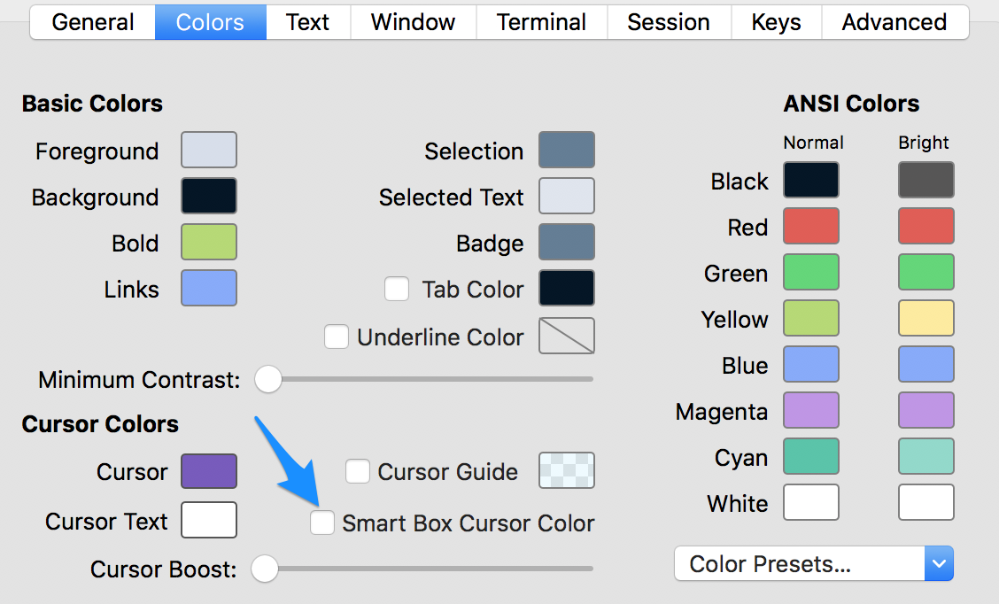

# Night Owl for iTerm2

A port of Sarah Drasner’s [Night Owl VS Code theme](https://github.com/sdras/night-owl-vscode-theme) for iTerm2.

## Installation

1. [Download Night Owl for iTerm2](https://github.com/nickcernis/iterm2-night-owl/archive/master.zip).
2. Install [iTerm2](https://www.iterm2.com/).
3. Launch iTerm2.
4. Press <kbd>Cmd</kbd>+<kbd>,</kbd> to open preferences.
5. Visit Profiles → [Your Profile Name] → Colors.
6. Choose “Import…” from the “Color Presets” drop-down.
7. Import the `Night Owl.itermcolors` file.
8. Choose “Night Owl” from the Color Presets.
9. Repeat step eight for each profile you’d like to use Night Owl for.

## Updating

1. [Download Night Owl for iTerm2](https://github.com/nickcernis/iterm2-night-owl/archive/master.zip).
2. Open iTerm2. 
3. Visit Profiles → [Your Profile] → Colors.
4. Choose “Delete Preset…” from the “Color Presets” drop-down.
5. Delete the Night Owl preset.
6. Choose “Import…” from the “Color Presets” drop-down.
7. Import the `Night Owl.itermcolors` file.
8. Choose “Night Owl” from the Color Presets. 

## Tips

I recommend that you untick “smart box cursor color” to get a purple cursor color that more closely matches VS Code.

